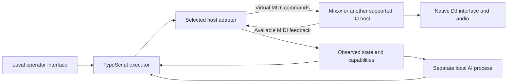

# Desktop AI DJ and host compatibility

> This document was autonomously generated by an AI agent at the user's request. It is a planning draft for human review.

Date: 2026-09-13. Research and proposed direction; no host integration has been runtime-tested.

## Decision: build a desktop product

The AI DJ can remain an application on the same computer as the DJ software. A Raspberry Pi is an optional deployment experiment, not a prerequisite for a useful product or a required desktop release milestone. Keep the earlier Pi research for a future measured need.

These are processes and routes on one computer. The AI process chooses musical actions; the TypeScript/Node.js service validates and executes them. The DJ host continues to play audio and display its actual state. The operator can disarm execution directly. Closing a browser interface must not terminate communication.

On our Mac, Apple's IAC Driver provides MIDI buses between applications. Use separate command and feedback buses, with exact routing chosen during the first integration test. This supplies the virtual cable; the receiving application must still accept the endpoint and map the messages. [Apple's inter-application MIDI documentation](https://support.apple.com/guide/audio-midi-setup/transfer-midi-information-between-apps-ams1013/mac).

## One controller, separate host adapters

Keep musical intent independent of vendor addresses. For example, the executor asks an adapter to set a deck's playing state. The adapter uses that host's mapping, reports which feedback is available, and identifies whether the result can actually be confirmed.

| Host | What official documentation establishes | What we must prove |
| --- | --- | --- |
| Mixxx | Controller scripts receive MIDI, change controls and send MIDI feedback. This makes a custom mapping and richer protocol possible. | Virtual-port pairing, control/UI agreement, snapshots and timing on the chosen version; extensions for missing operations. |
| Serato DJ Pro | MIDI mapping and output lighting exist, with device/feature restrictions. | Our virtual endpoint is accepted in the exact licensed operating mode; each required input and feedback route works. No claim of full-state or full-feature access. |
| Traktor | Controller Manager explicitly accepts virtual input/output ports between applications and supports input/output assignments. | Exact operations, feedback precision, track identity, UI behavior and runtime timing on the chosen version. |

Sources: [Mixxx controller scripting](https://github.com/mixxxdj/mixxx/wiki/MIDI-Scripting), [Serato mapping](https://support.serato.com/hc/en-us/articles/209377487-MIDI-mapping-with-Serato-DJ-Pro), [Serato output settings](https://support.serato.com/hc/en-us/articles/223446808-MIDI), and [Traktor Controller Manager](https://support.native-instruments.com/support/solutions/articles/69000879471-how-to-use-the-controller-manager-in-traktor).

Serato Play allows mixing without primary Serato hardware. That statement does not establish that our virtual MIDI input and output will work in that mode. Treat license/mode, MIDI device recognition and available feedback as separate tests. Existing DJ hardware a host may require is also distinct from building our own AI box. [Serato Play documentation](https://support.serato.com/hc/en-us/articles/360001274856-Serato-Play).

The proposed Mixxx SysEx handshake is a protocol we would implement on both ends. Serato and Traktor will not understand it merely because they support MIDI. Their adapters must use supported mappings and expose honest capabilities: command support, observable state, UI visibility, and runtime verification are separate facts. In particular, a play LED does not establish a stable track ID, load completion, beat grid or a full application snapshot.

We do not need source access to send supported MIDI commands. Source access matters when the host does not expose a required operation or observation. Our Mixxx fork lets us investigate and add narrow extensions; we cannot promise equivalent extensions inside closed-source hosts. A limited adapter must restrict autonomous actions to what it can safely observe and execute, while preserving the full Mixxx target.

## When an external device could help

Reconsider a separate computer only after measurements or a product requirement justify it: moving inference off an overloaded DJ computer, providing dedicated physical controls, or packaging an appliance. A Pi is one candidate, not a guaranteed performance improvement. It brings additional transport, power, thermal, deployment and recovery work.

Changing from a virtual cable to a physical MIDI cable does not itself add missing host APIs, stable track identity or richer feedback. It also does not guarantee precise musical timing. Measure responsiveness and audio behavior locally first, with inference isolated in another process and under realistic CPU load.

## Consequences for the worker plan

1. Keep the TypeScript communicator, deterministic executor, Mixxx mapping, local AI process and visible feedback as the main development path.
2. Complete the desktop acceptance gates independently of the Pi branch. The desktop app is a deliverable, not just a hardware prototype.
3. Add a bounded compatibility investigation for each additional host before implementing its adapter. Never assign a worker to make every DJ application compatible in one task.
4. Keep the full Mixxx inventory, timing tests, takeover, reconnect and observed-state requirements. Software-only deployment does not relax these gates.

For each additional host, instantiate these sequential tasks with the host/version and owned evidence file fixed before dispatch. Each estimate includes reading, execution, validation and handoff. A supervisor must track elapsed time, require a scope check by minute 20, collect the handoff by minute 27, and stop the worker at minute 30. Unfinished work becomes a smaller continuation with explicit remaining steps and checks; it is not marked complete. These are dispatch requirements, not an implemented watchdog. No purchase, installation or live runtime test is performed by this planning document.

| Task | Worker | Bound and execution steps | Validation steps | Dependencies and ownership |
| --- | --- | --- | --- | --- |
| HOST-01 | `gpt-5.6-sol`, high | 20 minutes. Inspect official mapping and operating-mode docs. Record version, license/mode, endpoint requirements and five initial controls. | Cite supporting pages; label unestablished virtual MIDI and state access as unknown. List exact runtime prerequisites. | No other host work required; owns `work/hosts/<host>/assessment.md`. |
| HOST-02 | `gpt-5.6-terra`, high | 25 minutes. In an available isolated host, select the two virtual routes and test one play command plus one readable feedback signal. | Capture actual UI and returned bytes; change the same control manually. Record missing feedback or rejected endpoints as a failed/limited result. | HOST-01 accepted, lawful installed runtime/license and exclusive host fixture available; owns `work/hosts/<host>/connection.md`. |
| HOST-03 | `gpt-6-astra`, high | 25 minutes. Review those results against executor needs. Define one host adapter contract and enumerate separate per-capability follow-ups. | Distinguish supported inputs from confirmed results and unavailable identity/state. Reject any promise that unimplemented Mixxx SysEx works in this host. | HOST-02 terminal evidence; owns `work/hosts/<host>/adapter-decision.md`. |

Paths in this table are relative to `docs/ai-dj/`. Model names are choices exposed in this Codex session, not a guarantee of future availability. Recheck at dispatch. If setup or testing will exceed the bounded scope, stop and create smaller prerequisite tasks; unknown compatibility is a valid research outcome, not a completed integration.

> End of autonomously AI-generated planning document.
