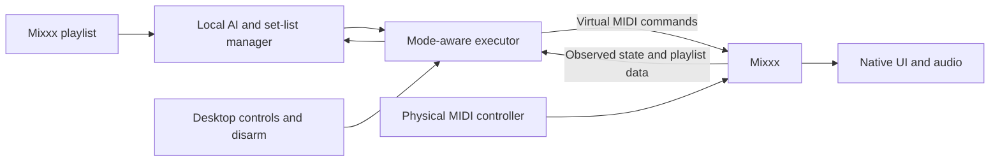

# Desktop build scope

> This document was autonomously generated by an AI agent at the user's request. It is a planning draft for human review.

Current decision: **Mixxx and our desktop app only.** Other DJ hosts, Raspberry Pi deployment and custom external AI hardware are outside this build. Earlier compatibility research is historical context, not an implementation queue.

The desktop service uses TypeScript/Node.js and a native MIDI binding. Mixxx's JavaScript mapping connects commands to host controls and returns observed state. The local AI planner runs separately. A TypeScript/HTML interface manages playlist selection, the planned and live set, modes, control ownership and Disarm AI.

All application processes run on one computer. The physical controller controls Mixxx directly through its normal mapping; it is not an external AI computer. The virtual command and feedback paths must not echo controller traffic back as new commands.

macOS supplies inter-application MIDI buses through its IAC Driver. Actual endpoint pairing and timing remain runtime validation tasks. [Apple documentation](https://support.apple.com/guide/audio-midi-setup/transfer-midi-information-between-apps-ams1013/mac).

The required result is a playlist-to-set product: accept a Mixxx playlist, preserve all its entries, let AI arrange a musical order, allow set-list edits, execute and observe transitions, and retain honest playback history. Native playlist access and stable track loading may need narrow Mixxx services exposed through the custom MIDI protocol; they are part of this build, not deferred extensions to another product.

Modes and priorities are specified in [HUMAN-CONTROL.md](HUMAN-CONTROL.md). In AI Only the AI controls performance; in B2B human gestures temporarily override affected controls; in Playlist Only AI organizes the set and the user mixes. Disarm takes priority in every mode.

Keep module boundaries because they make the code testable and reliable. Do not add speculative host adapters, physical AI device routing, ARM deployment tasks, or hardware purchases to this build. See [PLAN.md](PLAN.md) for the architecture and [PLAYLIST-SETS.md](PLAYLIST-SETS.md) for full-set acceptance.

> End of autonomously AI-generated planning document.
