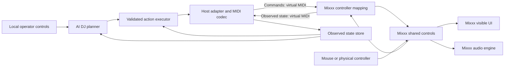

# AI DJ architecture and implementation plan

> This document was autonomously generated by an AI agent at the user's request. It is a planning draft for human review.

Date: 2026-09-13. Status: planning; TypeScript/Node.js direction accepted by the user; implementation has not started.

## 1. Product and scope

Build a desktop AI DJ player/controller that performs by sending MIDI commands and receiving MIDI feedback. Mixxx supplies the initial decks, audio engine, library, effects, and visible controls. The controller and DJ host run on the same local computer, connected through virtual MIDI. This build targets Mixxx and the desktop app only. Raspberry Pi and other DJ hosts are outside the current build.

The central workflow is: select a Mixxx playlist, let the AI arrange all its entries into an enjoyable set, review or edit the set list, then perform it through visible Mixxx controls. Track selection and set-list management are required in this build. The user explicitly chose AI-arranged order. Required modes are AI Only (AI performance authority), B2B (human priority through the current transition, then conditional return), and Playlist Only (AI arrangement, human mixing). See [playlist-to-set behavior](PLAYLIST-SETS.md) and [playing B2B with the AI](HUMAN-CONTROL.md).

The user must see the actual Mixxx controls and playback state change. An activity display that merely says a MIDI command was sent does not satisfy this requirement.

The full-feature target is retained. We must inventory performance controls, library operations, application settings, and hidden/modal actions, then give each a tested MIDI route or identify the host extension needed. “Every feature” is an acceptance target, not a claim about today's host API.

Initial assumptions:

- Two decks, local audio files, one selected Mixxx skin, and virtual MIDI on macOS.
- A local TypeScript/HTML desktop interface is required for playlist selection, set planning, live progress and disarm. A CLI is only an early diagnostic tool; a Mac launcher starts the separate local service and opens the UI on loopback.
- No cloud service is required for the deterministic prototype. AI model/provider selection is deferred until measured requirements exist. Local hosting does not imply a model has been chosen or benchmarked.
- Mixxx plays and mixes audio. MIDI transports control and feedback; it does not carry the music.
- A physical MIDI controller may operate Mixxx at the same time as the AI. In B2B, human gestures temporarily own the affected controls with debounced, state-aware return to AI. AI Only overrides ordinary manual adjustments; Playlist Only disables AI performance commands. Global disarm stays latched in every mode.
- Current implementation tasks exclude other DJ hosts, Pi deployment and custom hardware.

## 2. Boundaries and data flow

The diagram describes the logical flow, not a synchronous C++ call chain. Mixxx has thread and confirmation boundaries.

| Component | Responsibility |
| --- | --- |
| Planner | Arrange every playlist occurrence, choose upcoming tracks and bounded transitions, and adapt the remaining set to human changes. No direct MIDI access. |
| Set-list manager | Preserve playlist occurrences, planned order, pins, edits, playback history, unresolved entries and durable resume state. |
| Executor | Enforce preconditions, deck ownership, timing, deadlines, cancellation, and confirmed outcomes. |
| Host adapter | Convert semantic actions such as `deck.set_playing` into a versioned host profile. |
| MIDI transport | Open local input/output ports, encode messages, enforce priority and bandwidth limits, and reconnect. |
| State store | Track actual values, freshness, track identity, capabilities, and unresolved actions. Requested state is separate. |
| Mixxx mapping | Decode commands, use shared controls, and encode snapshots and change feedback. Keep it small and deterministic. |
| Optional Mixxx extension | Expose specific missing library/settings operations through existing host services, reachable through MIDI. Add only after demonstrating a gap. |
| Analysis/catalog | Hold local track identity, prepared musical features, and selection metadata. Do not write Mixxx's live database directly. |

Planned layout is an independent `ai-dj/` TypeScript package in this fork, with `core`, `execution`, `midi`, `hosts/mixxx`, `catalog`, `sets`, `analysis`, `planner`, and `local-ui` modules. It runs as a separate desktop service/process; the fork holds the mapping and narrowly required host changes. No runtime folders are created in this planning pass.

### Accepted implementation stack

Build the communicator in **TypeScript running on Node.js**, with native MIDI access through an RtMidi binding. This decision replaces the previously deferred controller-language choice. TypeScript supplies typed action, capability, and state contracts; incoming MIDI and inter-process messages still require runtime validation.

| Layer | Technology | Responsibility |
| --- | --- | --- |
| Local operator interface | TypeScript and HTML; required desktop interface | Controls, state monitoring, and manual takeover; browser UI communicates with the local service. |
| Communicator and executor | TypeScript on Node.js | MIDI encoding/decoding, bounded command queues, state reconciliation, deadlines, and cancellation. |
| MIDI port access | Native RtMidi binding; `@julusian/midi` is the initial candidate | Virtual and physical MIDI input/output through OS MIDI facilities. |
| Mixxx controller mapping | JavaScript in Mixxx | Translate MIDI into shared controls and send observed state back. |
| AI planner and expensive analysis | Separate local process; model/runtime still to be selected | Produce structured plans without running inference or blocking analysis on the MIDI event loop. |
| Audio and host synchronization | Existing Mixxx engine | Audio processing and supported sync/quantized actions. |

Keep the communicator independent of the browser tab. Use asynchronous local IPC with bounded messages between it and the planner, and a loopback connection for the required browser interface. Planner failure or slow inference must not prevent MIDI feedback, releases, cancellation, or operator takeover. Process isolation reduces contention in the communicator's event loop; it does not eliminate OS scheduling or shared-CPU contention.

Evaluate `@julusian/midi` in the first spike, pin a compatible Node/package combination, and verify native installation, port routing, disconnect behavior, and SysEx reception. Its documentation describes macOS and Linux virtual ports and notes that SysEx is ignored by default; explicitly configure the input filter for our protocol. Only the current desktop OS is a build gate; ARM/Pi compatibility is outside scope. Keep the binding behind a transport interface so it can be replaced without rewriting the planner or host contracts. See [the binding documentation](https://github.com/julusian/node-midi).

### Why use the shared control system?

Source inspection shows that MIDI mappings can dispatch JavaScript, and scripts can set shared controls. Widget connections subscribe to changes in those controls. This gives the intended UI behavior without simulated mouse dragging. Confirmation and control filters can still delay or reject a request, and a skin may not display a particular control. Both the feedback and the visible UI need testing. See [research](RESEARCH.md).

## 3. Local test setup

Use two separate virtual MIDI buses:

1. `AI DJ Commands`: AI DJ writes; Mixxx reads.
2. `AI DJ Feedback`: Mixxx writes; AI DJ reads.

Use macOS IAC buses for the first experiment, validating the selected ports and routing in Mixxx. A virtual-port backend is an alternative if Mixxx's input/output device pairing requires it. Endpoint names are proposals, not already configured devices. Keep feedback separate from commands to prevent an echo loop.

Initial sequence: launch Mixxx with a dedicated test profile and known tracks, enable the custom mapping, launch the local controller, complete the capability/snapshot handshake, then explicitly arm automation. Inspect controls through Mixxx developer mode while testing. Use the legacy skin path first because it is the UI path traced in this review; validate QML separately.

The first proof can use the stable release's common controls without rebuilding Mixxx. The fork's 2.7-alpha APIs, including the inspected player metadata proxy, require a separate version profile and runtime verification. Do not install an alpha over a live performance profile.

## 4. MIDI contract proposal

There are two profiles: a small conventional controller profile for the first visible experiment, followed by an extended profile for dependable automation. Both send and receive MIDI.

### Conventional profile

The following addresses are our proposed mapping, not built-in Mixxx assignments:

| Operation | Proposed message | Mapping behavior |
| --- | --- | --- |
| Deck 1 playing state | Channel 1 CC 20; value 0 or 127 | Set `[Channel1],play` to 0 or 1; use desired state, not a toggle. |
| Deck 2 playing state | Channel 2 CC 20; value 0 or 127 | Same action on `[Channel2]`. |
| Deck volume | Per-deck CC 7 | Normalize 0–127 to 0–1; call `engine.setParameter`. |
| Mixer crossfader | Channel 16 CC 8 | Normalize to 0–1 through `setParameter`; raw Mixxx values are -1–1. |
| Momentary cue action | Per-deck Note 36 | Handle both note release and Note On velocity zero; preserve press/release semantics. |
| State feedback | Corresponding address on feedback bus | Encode actual control value after change; never feed it back as a new command. |

For example, `B0 14 7F` requests Deck 1 play under this proposed profile. It is successful only after the host reports the expected state. These bytes are illustrative; no mapping has been installed.

Use 7-bit controls for the initial demonstration. Add explicit paired 14-bit CCs for smooth gain/tempo changes after testing quantization and pair assembly. Do not assume NRPN or MIDI 2.0 support. The inspected Mixxx legacy mapper has 14-bit handling and can discard incomplete/interleaved pairs. Prefer one explicit codec contract, with pair timeouts and serialized emission.

### Extended profile

Define an application-specific, versioned SysEx protocol for capabilities, snapshots, correlations, numeric precision, metadata, and host extensions. Mixxx supports SysEx input dispatch and output, but all message meanings below are new work:

- `HELLO` / `CAPABILITIES`: protocol version, adapter version, host version, active decks, readable/writable/action controls, metadata support, and payload limits.
- `SNAPSHOT_REQUEST` / `SNAPSHOT_BEGIN` / `STATE` / `SNAPSHOT_END`: authoritative state with a session ID and snapshot revision.
- `SET` / `TRIGGER`: numeric capability ID, value or action arguments, sequence ID, deadline, expected track generation, and ownership generation.
- `ACCEPTED` / `RESULT` / `ERROR`: distinguish a parsed request from an observed postcondition. Include resulting value or explicit uncertainty.
- `HEARTBEAT`, `CANCEL`, `DISARM`: controller lifecycle independent of transport connection.
- Required for this build: paginated playlist/catalog reads, ordered playlist occurrence snapshots, `LOAD_TRACK_ID`, bounded `TRACK_METADATA`, and save-new-playlist operations. These need narrow host services exposed through MIDI where existing controls are insufficient.

Before implementing the codec, freeze the wire layout: manufacturer/development identifier, protocol bytes, session/sequence widths, opcodes, payload lengths, numeric encoding, checksum, and error codes. Use 7-bit-safe packing inside SysEx, bounded frame sizes and reassembly deadlines. Strings need length-limited UTF-8 packing. Reject malformed or unknown commands; never evaluate received script text or accept arbitrary internal function names.

Keep the conventional profile for manual compatibility. Require the extended profile for actions needing correlation and replay protection. A conventional CC has no request ID or proof of who changed a value.

### Feedback, retries, and reconnects

- Subscribe to host changes and request a startup snapshot. Changes made with the mouse or another controller must update AI state.
- Buffer deltas during a snapshot or sequence them against its revision. Otherwise a recent change can be overwritten by an older snapshot item.
- An unchanged control may emit no event. Explicitly return a current observation for an already-satisfied request; missing change events are not automatically failures.
- Refresh state before any consequential action. Unknown or stale state prevents that action.
- Retrying a desired-state setter can be safe only after checking its context. Never blindly replay a toggle, load, cue trigger, or relative adjustment. Deduplicate extended requests by session and sequence ID.
- On reconnect, discard queued musical actions, negotiate again, refresh state, and require re-arming. Do not replay the old transition.
- Coalesce continuous telemetry and prioritize cancellation, releases, and command results over meters or metadata. Measure USB/virtual-MIDI behavior and keep large transfers away from transitions.

## 5. DJ execution and AI behavior

Build a deterministic DJ first. A transition is a state machine:

`observe → select → prepare idle deck → confirm loaded identity → cue/sync → start → blend → confirm completion → release deck`

Every step has a precondition, an observed success condition, a deadline, and a cancellation path. Track load invalidates the old deck generation and any queued actions aimed at it. The initial MIDI proof can use two preloaded tracks; the delivered build requires native Mixxx playlist selection and stable identity/load confirmation for every scheduled entry.

The AI planner in this build arranges the playlist using tempo, musical key, energy, phrasing, confidence, human constraints and set history. These are inputs to a policy, not all data that MIDI automatically supplies. Prepared local analysis can supply missing musical features. Acoustic listening, waveform transfer, and stem analysis need separate audio/data paths if added; MIDI meters are not audio.

The model returns structured musical intent, for example a target deck, track ID, transition type, length in beats, and bounded parameter curves. Validate that output against capabilities and limits. Never ask a language model to emit each time-critical CC or to run inside the audio callback.

### Timing

The inspected legacy MIDI handler explicitly ignores incoming `0xF8` beat clock. Do not design synchronization around sending MIDI clock to Mixxx. Initially use the host's sync and quantized control behaviors, confirmed tempo/playhead feedback, and conservative transitions.

MIDI arrival, script timers, and UI repaint are not sample-accurate timing guarantees. Measure command-to-state and audible timing separately. If the required performance cannot be achieved, add a bounded host-side scheduler driven through MIDI and integrated with the appropriate engine mechanisms. That is a future extension, not something the current scripting API has been proven to provide.

Our TypeScript/Node.js service targets responsive real-time control, with measured latency and timing variation. It does not provide hard real-time deadlines: [Node.js explicitly does not guarantee exact timer callback timing](https://nodejs.org/api/timers.html#settimeoutcallback-delay-args). A native MIDI binding provides OS MIDI access but does not remove JavaScript event-loop, garbage-collection, or system scheduling delays.

Use monotonic deadlines and bounded queues; cancel expired actions rather than emitting a burst of old musical commands. Keep heavy computation, synchronous file work, and per-message console output away from MIDI handling. Start with play, cue, faders, EQ, effects, and observed feedback; measure tight scratching and beat-critical execution before claiming support. If measured scheduling limits prevent an acceptance gate, move only the critical scheduler into native code or the host engine as appropriate, preserving the TypeScript service and contracts. A native rewrite alone is not a timing guarantee.

### Human control

Automation starts disarmed. A local disarm action cancels future AI actions without stopping the playing deck. On essential feedback loss, disarm new performance output while preserving playback where possible. A late or failed planner may use a previously validated deterministic fallback only with fresh state, valid capabilities and current authority; otherwise stop initiating new transitions and show the reason.

The physical MIDI controller remains connected directly to Mixxx. In B2B, observed manual changes yield the affected AI control immediately; related transition steps are invalidated when needed. Bass adjustment, for example, suspends AI bass writes without stopping independent work. A configurable quiet period (initially 3 seconds) resets on each relevant gesture. Hold the affected item for the rest of the current transition, even after quiet expiry. At a later transition start, require release and quiet expiry, reconcile fresh state and replan from the user's current value; never snap back to an abandoned target. Honor explicit touch/release when available, and report value-only inference honestly. Preserve hardware soft takeover behavior.

In B2B, a human-loaded replacement song becomes the new musical direction. Cancel actions for the previous track, confirm the new track identity and observed state, and adapt the affected transition and remaining set while preserving human control holds. Do not restore the old AI song choice or falsely complete its playlist occurrence. Record the replacement and keep the displaced occurrence available later unless the user explicitly skips it; preserve partial playback spans. Manual Pause/Stop creates a latched deck transport hold, unaffected by the quiet timer.

The user can pin individual controls or press a global Disarm AI button. These explicit holds, transport loss and restart require deliberate resumption. Routine B2B gestures can return to AI only at a later transition start after release, debounce and reconciliation; a beat/bar boundary within the current transition is insufficient. In AI Only, ordinary manual changes trigger bounded recovery to the valid AI plan; they do not create B2B holds. Playlist Only permits planning/read operations and explicit playlist saves but emits no live performance commands. Mode changes invalidate queued work using a mode epoch and refresh state. Already-armed AI Only/B2B switches continue under the new mode without another resume action; explicit disarm remains latched. Selecting AI Only or B2B from Playlist Only is sufficient to begin after reconciliation, unless explicit disarm is latched. See [B2B ownership and acceptance scenarios](HUMAN-CONTROL.md).
Use separate policies for active-deck loading, stopping the audible deck, master gain, and recording/broadcasting. Defaults should support a stable set: bounded gains, no surprise deck replacement, and recording/broadcast actions only when armed for them. Mixxx AutoDJ and this executor must not independently control the same transition.

## 6. UI visibility and feature completeness

For every feature, track four independent facts: can send the action, can observe the outcome, can see the result in the selected UI, and has been tested at runtime. A control existing in a source declaration is only a candidate.

Native controls should move or illuminate in Mixxx. Hidden controls require showing the relevant panel; features with no native indicator may need a small host status view. That view must display observed state, not optimistic success. A local AI dashboard can show intent, pending actions, observations, and failure reasons alongside Mixxx.

See [feature coverage](CONTROL-COVERAGE.md). The complete inventory is a deliverable of implementation milestone 1, covering both runtime controls and UI actions that have no control entry. Do not declare 100% coverage from the generated control list alone.

## 7. Milestones and acceptance gates

| Milestone | Work | Required evidence |
| --- | --- | --- |
| 0 — Planning | Fork, inspect source/docs, define boundaries and gaps. | These documents; no runtime claims. |
| 1 — Local MIDI proof | TypeScript/Node.js sender/receiver, candidate RtMidi binding, JavaScript Mixxx mapping, two local ports, initial capability inventory, and timing measurements. | Play, volume, crossfader, cue, and sync affect Mixxx; feedback follows service and mouse actions; no echo loop; measured latency/jitter under idle and loaded conditions. |
| 2 — Reliable executor | Sessions, snapshots, action/result tracking, track generations, cancellation, takeover. | No stuck cue on disconnect; rejected/unchanged actions reconcile correctly; stale state blocks loading; restart causes no replay. |
| 3 — Playlist and deterministic set | Native Mixxx playlist import, occurrence identities, set persistence/editing and stable load adapter; deterministic transition templates. | Every playlist entry accounted for; repeated transitions with correct track IDs, visible controls and reviewed audio; native playlist and saved-set round trips. |
| 4 — AI playlist performance | Local model/runtime evaluation, prepared analysis, AI order and transition choices, required desktop set-list UI and B2B handover. | Whole playlist performed; invalid/late output rejected; user edits/gestures respected; listener comparison against an AutoDJ baseline. |
| 5 — Full Mixxx coverage | Complete audited feature inventory; extend missing operations and feedback. | Every inventoried feature has send/receive/UI evidence or an explicitly unresolved gap; no silent scope reduction. |
| 6 — Desktop release | Local setup/launch, saved sets, human-controller coexistence and full-playlist endurance/quality review. | Reproducible desktop startup; full-playlist accounting, at least 30 minutes continuous audio, B2B scenarios, persisted state and release evidence. |

Proposed acceptance budgets are defined in [delegated defaults](DEFAULTS.md#r3-q17-what-responsiveness-targets-should-we-test-first): command send to host observation p95 ≤30 ms / p99 ≤75 ms; recognized human input to AI cancellation p95 ≤20 ms / p99 ≤50 ms; observed state to app display p95 ≤100 ms. Measure native Mixxx UI, scheduling error and audible onset separately. These are planning targets, not timing guarantees. F01/M19 must freeze the host-quantized beat-critical gate with clock uncertainty before claiming musical timing support. At least one uninterrupted 30-minute set and a full 6-hour endurance run use the persistent-job workflow. Verify all required playlist occurrences and distinguish 10-minute experience tests from endurance evidence.

The first milestone must record the chosen Node version, MIDI binding, host version, routing, and machine configuration. Measure MIDI loopback round-trip latency separately from command-to-confirmed-host-state latency, UI updates, and audible timing. Capture p50/p95/p99, worst observed delay, missed deadlines, and deviation from scheduled dispatch intervals. Use one monotonic clock where possible; do not label round-trip measurements as one-way latency. Compare idle conditions with a controlled CPU/analysis workload in a separate process, then repeat with the selected model when available. Verify UI closure and a stalled planner do not stop the communicator. The initial timing spike determines whether the Node executor meets the prototype budgets or needs a narrowly scoped scheduler extension.

Validation should include protocol parser tests, malformed/duplicate/out-of-order frames, control scaling boundaries, snapshot races, unavailable features, hotcue press/release, track load failure, human changes during curves, focus changes, and reconnect. Each UI gate needs a real Mixxx run. Logs should include monotonic timestamps and correlation IDs but avoid unnecessary local file paths and library metadata.

The [worker catalog](WORKER-TASKS.md) decomposes these milestones; [traceability](TRACEABILITY.md) maps discovery decisions to implementation and evidence. [DEFAULTS.md](DEFAULTS.md) completes the remaining product choices under explicit user delegation.

## 8. Desktop build boundary

Finish the Mixxx desktop product, including native playlist selection, AI order, set editing, reliable full-set performance and physical-controller B2B use. Neither another host nor external AI hardware is in this build. Keep the transport and host code separated for maintainability, without adding speculative adapters or Pi deployment tasks. Prior compatibility/hardware research is background only.

## 9. Decisions deferred until implementation

Choose the precise stable-versus-alpha runtime baseline; compatible Node version and MIDI binding version after the timing spike; local AI model and inference runtime; narrow playlist/catalog/identity extension; and focused UI rendering/build libraries. The delivery form is a local Mac launcher plus persistent Node service and browser UI. These are implementation choices, not grounds to defer required playlist or UI features. TypeScript/Node.js for the communicator and JavaScript for the Mixxx mapping are accepted decisions. Preserve the separate controller, MIDI boundary, visible Mixxx behavior, and all-local initial setup in each remaining decision.

> End of autonomously AI-generated planning document.
