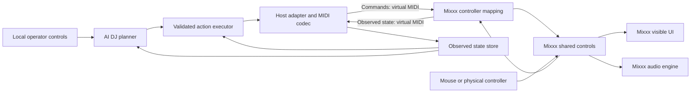

# AI DJ architecture and implementation plan

> This document was autonomously generated by an AI agent at the user's request. It is a planning draft for human review.

Date: 2026-09-13. Status: proposed; implementation has not started.

## 1. Product and scope

Build an AI DJ player/controller that performs by sending MIDI commands and receiving MIDI feedback. Mixxx supplies the initial decks, audio engine, library, effects, and visible controls. All initial processes run on the same local computer. Later, the controller can move to a Raspberry Pi without relocating the DJ decision logic into Mixxx.

The user must see the actual Mixxx controls and playback state change. An activity display that merely says a MIDI command was sent does not satisfy this requirement.

The full-feature target is retained. We must inventory performance controls, library operations, application settings, and hidden/modal actions, then give each a tested MIDI route or identify the host extension needed. “Every feature” is an acceptance target, not a claim about today's host API.

Initial assumptions:

- Two decks, local audio files, one selected Mixxx skin, and virtual MIDI on macOS.
- A local control interface may be a CLI first; a browser dashboard can bind to loopback later.
- No cloud service is required for the deterministic prototype. AI model/provider selection is deferred until measured requirements exist. Local hosting does not imply a model has been chosen or benchmarked.
- Mixxx plays and mixes audio. MIDI transports control and feedback; it does not carry the music.
- Other DJ applications require their own capability assessment and adapter. Mixxx's custom protocol is not automatically compatible with Serato or any other host.

## 2. Boundaries and data flow

The diagram describes the logical flow, not a synchronous C++ call chain. Mixxx has thread and confirmation boundaries.

| Component | Responsibility |
| --- | --- |
| Planner | Choose a next track and a bounded transition plan from available state and analysis. No direct MIDI access. |
| Executor | Enforce preconditions, deck ownership, timing, deadlines, cancellation, and confirmed outcomes. |
| Host adapter | Convert semantic actions such as `deck.set_playing` into a versioned host profile. |
| MIDI transport | Open local input/output ports, encode messages, enforce priority and bandwidth limits, and reconnect. |
| State store | Track actual values, freshness, track identity, capabilities, and unresolved actions. Requested state is separate. |
| Mixxx mapping | Decode commands, use shared controls, and encode snapshots and change feedback. Keep it small and deterministic. |
| Optional Mixxx extension | Expose specific missing library/settings operations through existing host services, reachable through MIDI. Add only after demonstrating a gap. |
| Analysis/catalog | Hold local track identity, prepared musical features, and selection metadata. Do not write Mixxx's live database directly. |

Suggested eventual layout is a separate AI DJ project with `core`, `execution`, `midi`, `hosts/mixxx`, and `local-ui` modules. The Mixxx fork holds its mapping and narrowly required host changes. No runtime folders are created in this planning pass.

### Why use the shared control system?

Source inspection shows that MIDI mappings can dispatch JavaScript, and scripts can set shared controls. Widget connections subscribe to changes in those controls. This gives the intended UI behavior without simulated mouse dragging. Confirmation and control filters can still delay or reject a request, and a skin may not display a particular control. Both the feedback and the visible UI need testing. See [research](RESEARCH.md).

## 3. Local test setup

Use two separate virtual MIDI buses:

1. `AI DJ Commands`: AI DJ writes; Mixxx reads.
2. `AI DJ Feedback`: Mixxx writes; AI DJ reads.

Use macOS IAC buses for the first experiment, validating the selected ports and routing in Mixxx. A virtual-port backend is an alternative if Mixxx's input/output device pairing requires it. Endpoint names are proposals, not already configured devices. Keep feedback separate from commands to prevent an echo loop.

Initial sequence: launch Mixxx with a dedicated test profile and known tracks, enable the custom mapping, launch the local controller, complete the capability/snapshot handshake, then explicitly arm automation. Inspect controls through Mixxx developer mode while testing. Use the legacy skin path first because it is the UI path traced in this review; validate QML separately.

The first proof can use the stable release's common controls without rebuilding Mixxx. The fork's 2.7-alpha APIs, including the inspected player metadata proxy, require a separate version profile and runtime verification. Do not install an alpha over a live performance profile.

## 4. MIDI contract proposal

There are two profiles: a small conventional controller profile for the first visible experiment, followed by an extended profile for dependable automation. Both send and receive MIDI.

### Conventional profile

The following addresses are our proposed mapping, not built-in Mixxx assignments:

| Operation | Proposed message | Mapping behavior |
| --- | --- | --- |
| Deck 1 playing state | Channel 1 CC 20; value 0 or 127 | Set `[Channel1],play` to 0 or 1; use desired state, not a toggle. |
| Deck 2 playing state | Channel 2 CC 20; value 0 or 127 | Same action on `[Channel2]`. |
| Deck volume | Per-deck CC 7 | Normalize 0–127 to 0–1; call `engine.setParameter`. |
| Mixer crossfader | Channel 16 CC 8 | Normalize to 0–1 through `setParameter`; raw Mixxx values are -1–1. |
| Momentary cue action | Per-deck Note 36 | Handle both note release and Note On velocity zero; preserve press/release semantics. |
| State feedback | Corresponding address on feedback bus | Encode actual control value after change; never feed it back as a new command. |

For example, `B0 14 7F` requests Deck 1 play under this proposed profile. It is successful only after the host reports the expected state. These bytes are illustrative; no mapping has been installed.

Use 7-bit controls for the initial demonstration. Add explicit paired 14-bit CCs for smooth gain/tempo changes after testing quantization and pair assembly. Do not assume NRPN or MIDI 2.0 support. The inspected Mixxx legacy mapper has 14-bit handling and can discard incomplete/interleaved pairs. Prefer one explicit codec contract, with pair timeouts and serialized emission.

### Extended profile

Define an application-specific, versioned SysEx protocol for capabilities, snapshots, correlations, numeric precision, metadata, and host extensions. Mixxx supports SysEx input dispatch and output, but all message meanings below are new work:

- `HELLO` / `CAPABILITIES`: protocol version, adapter version, host version, active decks, readable/writable/action controls, metadata support, and payload limits.
- `SNAPSHOT_REQUEST` / `SNAPSHOT_BEGIN` / `STATE` / `SNAPSHOT_END`: authoritative state with a session ID and snapshot revision.
- `SET` / `TRIGGER`: numeric capability ID, value or action arguments, sequence ID, deadline, expected track generation, and ownership generation.
- `ACCEPTED` / `RESULT` / `ERROR`: distinguish a parsed request from an observed postcondition. Include resulting value or explicit uncertainty.
- `HEARTBEAT`, `CANCEL`, `DISARM`: controller lifecycle independent of transport connection.
- Future `CATALOG_PAGE`, `LOAD_TRACK_ID`, and bounded `TRACK_METADATA`: enable stable song selection where the host adapter can support it.

Before implementing the codec, freeze the wire layout: manufacturer/development identifier, protocol bytes, session/sequence widths, opcodes, payload lengths, numeric encoding, checksum, and error codes. Use 7-bit-safe packing inside SysEx, bounded frame sizes and reassembly deadlines. Strings need length-limited UTF-8 packing. Reject malformed or unknown commands; never evaluate received script text or accept arbitrary internal function names.

Keep the conventional profile for manual compatibility. Require the extended profile for actions needing correlation and replay protection. A conventional CC has no request ID or proof of who changed a value.

### Feedback, retries, and reconnects

- Subscribe to host changes and request a startup snapshot. Changes made with the mouse or another controller must update AI state.
- Buffer deltas during a snapshot or sequence them against its revision. Otherwise a recent change can be overwritten by an older snapshot item.
- An unchanged control may emit no event. Explicitly return a current observation for an already-satisfied request; missing change events are not automatically failures.
- Refresh state before any consequential action. Unknown or stale state prevents that action.
- Retrying a desired-state setter can be safe only after checking its context. Never blindly replay a toggle, load, cue trigger, or relative adjustment. Deduplicate extended requests by session and sequence ID.
- On reconnect, discard queued musical actions, negotiate again, refresh state, and require re-arming. Do not replay the old transition.
- Coalesce continuous telemetry and prioritize cancellation, releases, and command results over meters or metadata. Measure USB/virtual-MIDI behavior and keep large transfers away from transitions.

## 5. DJ execution and AI behavior

Build a deterministic DJ first. A transition is a state machine:

`observe → select → prepare idle deck → confirm loaded identity → cue/sync → start → blend → confirm completion → release deck`

Every step has a precondition, an observed success condition, a deadline, and a cancellation path. Track load invalidates the old deck generation and any queued actions aimed at it. The initial demo can use two preloaded tracks; autonomous selection waits for a stable identity/load solution.

A later planner may choose tracks using tempo, musical key, energy, phrasing, and set history. These are inputs to a policy, not all data that MIDI automatically supplies. Prepared local analysis can supply missing musical features. Acoustic listening, waveform transfer, and stem analysis need separate audio/data paths if added; MIDI meters are not audio.

The model returns structured musical intent, for example a target deck, track ID, transition type, length in beats, and bounded parameter curves. Validate that output against capabilities and limits. Never ask a language model to emit each time-critical CC or to run inside the audio callback.

### Timing

The inspected legacy MIDI handler explicitly ignores incoming `0xF8` beat clock. Do not design synchronization around sending MIDI clock to Mixxx. Initially use the host's sync and quantized control behaviors, confirmed tempo/playhead feedback, and conservative transitions.

MIDI arrival, script timers, and UI repaint are not sample-accurate timing guarantees. Measure command-to-state and audible timing separately. If the required performance cannot be achieved, add a bounded host-side scheduler driven through MIDI and integrated with the appropriate engine mechanisms. That is a future extension, not something the current scripting API has been proven to provide.

### Human control

Automation starts disarmed. A local disarm action cancels future AI actions without stopping the playing deck. On feedback loss or model failure, preserve current playback and stop initiating new transitions.

If observed values diverge from an owned automation curve, yield the affected controls and refresh state. Feedback alone cannot reliably identify the source of a change, so do not label every difference as a known human action. Provide an explicit operator takeover control; keep physical-controller soft takeover behavior intact. Resuming automation is deliberate and uses a fresh snapshot.

Use separate policies for active-deck loading, stopping the audible deck, master gain, and recording/broadcasting. Defaults should support a stable set: bounded gains, no surprise deck replacement, and recording/broadcast actions only when armed for them. Mixxx AutoDJ and this executor must not independently control the same transition.

## 6. UI visibility and feature completeness

For every feature, track four independent facts: can send the action, can observe the outcome, can see the result in the selected UI, and has been tested at runtime. A control existing in a source declaration is only a candidate.

Native controls should move or illuminate in Mixxx. Hidden controls require showing the relevant panel; features with no native indicator may need a small host status view. That view must display observed state, not optimistic success. A local AI dashboard can show intent, pending actions, observations, and failure reasons alongside Mixxx.

See [feature coverage](CONTROL-COVERAGE.md). The complete inventory is a deliverable of implementation milestone 1, covering both runtime controls and UI actions that have no control entry. Do not declare 100% coverage from the generated control list alone.

## 7. Milestones and acceptance gates

| Milestone | Work | Required evidence |
| --- | --- | --- |
| 0 — Planning | Fork, inspect source/docs, define boundaries and gaps. | These documents; no runtime claims. |
| 1 — Local MIDI proof | Custom mapping, two local ports, deterministic sender/receiver, initial capability inventory. | Play, volume, crossfader, cue, and sync affect Mixxx; feedback follows AI and mouse actions; no echo loop. |
| 2 — Reliable executor | Sessions, snapshots, action/result tracking, track generations, cancellation, takeover. | No stuck cue on disconnect; rejected/unchanged actions reconcile correctly; stale state blocks loading; restart causes no replay. |
| 3 — Deterministic DJ set | Two-deck transition policy and stable track selection/load adapter. | Repeated local transitions with recorded MIDI/state traces, visible controls, confirmed track identity, and reviewed audio. |
| 4 — AI planning | Local model/runtime evaluation, track analysis, structured plan generation. | Invalid/late model output is rejected; model failure does not interrupt playback; musical quality judged on recorded sets. |
| 5 — Full Mixxx coverage | Complete audited feature inventory; extend missing operations and feedback. | Every inventoried feature has send/receive/UI evidence or an explicitly unresolved gap; no silent scope reduction. |
| 6 — Raspberry Pi | Move the same controller to Linux ARM; substitute physical transport. | Local parity suite plus cable removal, power/reboot recovery, CPU/thermal/memory and latency measurements. |

Prototype acceptance targets, to be tuned from measurements: p95 command-to-observed-state under 100 ms for simple controls; visible update within 150 ms; takeover cancellation within 100 ms while connected; disarm within 1 second of lost heartbeat. These are proposed budgets, not measured performance or musical timing guarantees. Run a 30-minute two-deck local set with no additional audio-overload events attributable to the controller, plus manual listening for glitches and transitions.

Validation should include protocol parser tests, malformed/duplicate/out-of-order frames, control scaling boundaries, snapshot races, unavailable features, hotcue press/release, track load failure, human changes during curves, focus changes, and reconnect. Each UI gate needs a real Mixxx run. Logs should include monotonic timestamps and correlation IDs but avoid unnecessary local file paths and library metadata.

## 8. Raspberry Pi path, later

Nothing in the current milestone requires a Pi, external network host, or hardware purchase. Keep OS-specific MIDI port management behind the transport interface now.

Later options are USB MIDI gadget mode on a validated board/port/kernel, or a conventional MIDI interface. Linux documents a bidirectional MIDI gadget function. Raspberry Pi documents OTG-capable ports, but its networking gadget setup is not automatically a MIDI configuration. Validate MIDI enumeration, routing, power, and reconnect on the actual target. See [hardware sources](RESEARCH.md#external-documentation).

A Pi running only the controller is the first portability target. A standalone enclosure running both Mixxx and the AI additionally needs audio-interface routing, display strategy, scheduling, storage, thermal, and inference benchmarks. Treat that as another system configuration. Do not assume the same Pi can handle local inference, stem processing, and low-latency audio simultaneously.

## 9. Decisions deferred until implementation

Choose the precise stable-versus-alpha runtime baseline; local AI model and inference runtime; controller implementation language after a MIDI timing spike; track catalog/identity extension; and operator UI. None blocks the planning deliverable. Preserve the separate controller, MIDI boundary, visible Mixxx behavior, and all-local initial setup in each decision.

> End of autonomously AI-generated planning document.
